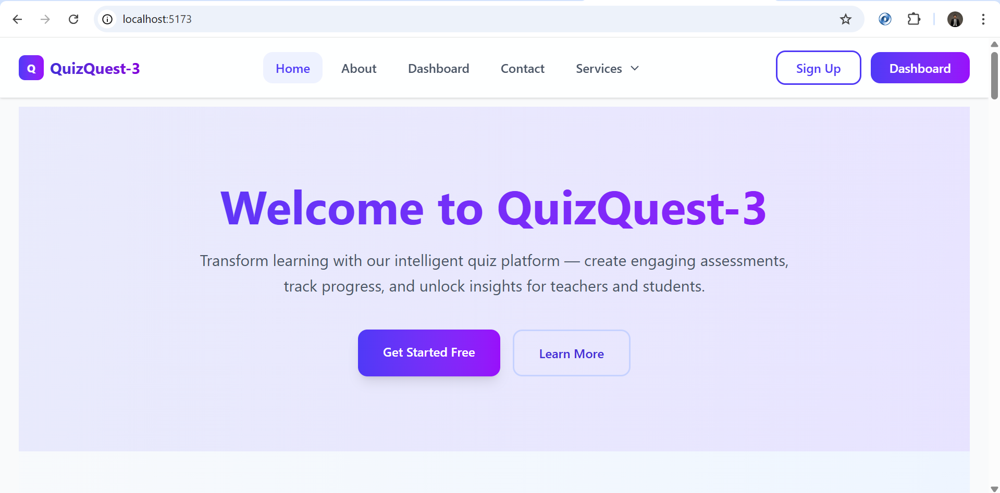
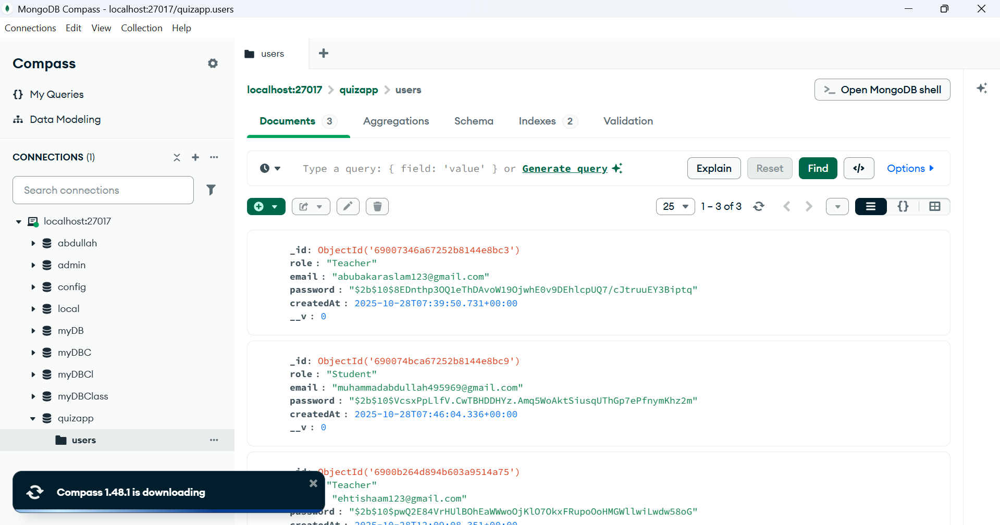
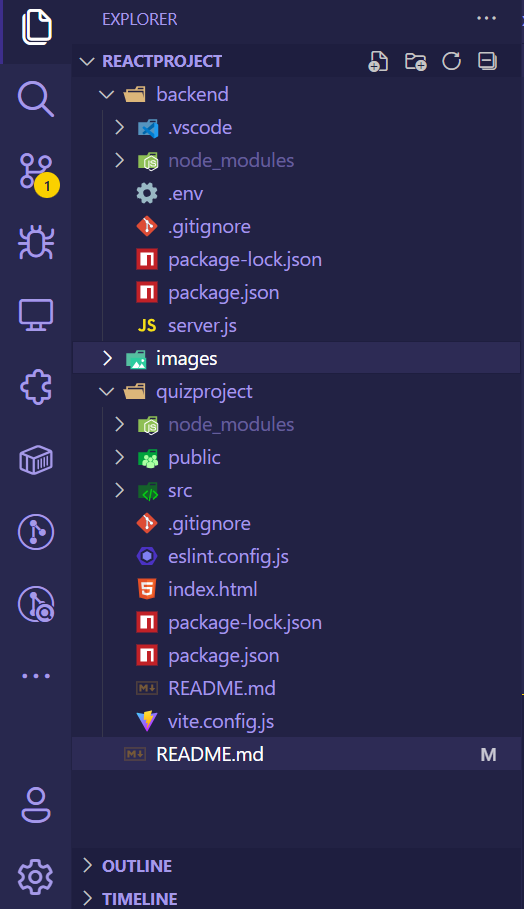

🤝 Development Team
🧑‍💻 Developers

Name: Farhan Butt, Abdullah Gujjar, Hassan Shah

GitHub: Awdproject1322269

Email: awdproject123@gmail.com

# QuizQuest-3 🎯

A modern, role-based quiz application built with React.js and Node.js that allows teachers to create quizzes and students to attempt them with real-time performance tracking.

## 🚀 Live Demo

**Frontend:** http://localhost:5173  
**Backend API:** http://localhost:5000

## ✨ Features

### 👨‍🏫 Teacher Features

- Create and manage quizzes
- Track student progress and performance
- Generate detailed reports
- Class management system
- Real-time analytics dashboard

### 👨‍🎓 Student Features

- Attempt assigned quizzes
- View performance history
- Track learning progress
- Interactive dashboard
- Score analytics

### 🔐 Security Features

- Role-based authentication (Teacher/Student)
- Auto logout after 30 minutes of inactivity
- Password hashing with bcrypt
- Protected routes
- Session management

## 🛠️ Tech Stack

### Frontend

- **React.js** - UI framework
- **React Router DOM** - Navigation
- **Tailwind CSS** - Styling
- **Vite** - Build tool
- **Axios** - HTTP client

### Backend

- **Node.js** - Runtime environment
- **Express.js** - Web framework
- **MongoDB** - Database
- **Mongoose** - ODM
- **bcryptjs** - Password hashing
- **CORS** - Cross-origin requests

## 🚀 Installation & Setup

### Prerequisites

- Node.js (v14 or higher)
- MongoDB Compass (Local Installation)
- npm or yarn

### 1. Frontend Setup

```bash
# Navigate to frontend folder
cd reactproject/quizproject

# Install dependencies (if not already installed)
npm install

# Start development server
npm run dev
Frontend will run on: http://localhost:5173



2. Backend Setup
# Navigate to backend folder
cd reactproject/backend

# Install dependencies
npm install express mongoose cors bcryptjs dotenv
npm install -D nodemon

# Start backend server
npm run dev
Backend will run on: http://localhost:5000

3. Database Setup

1.Open MongoDB Compass

2.Connect to: mongodb://localhost:27017

3.Database quizapp will be created automatically

4.Collection users will be created automatically



4. Environment Configuration
Create backend/.env file:
PORT=5000
MONGODB_URI=mongodb://localhost:27017/quizapp

🔧 Running the Complete Application

Terminal 1 - Backend
cd reactproject/backend
npm run dev

Terminal 2 - Frontend
cd reactproject/quizproject
npm run dev

Access Points:
Application: http://localhost:5173

Backend API: http://localhost:5000

MongoDB Compass: mongodb://localhost:27017



📊 API Endpoints
Authentication
POST /api/register - User registration

POST /api/login - User login

Test API
GET /api - Check backend status

🎨 UI/UX Features
Responsive Design - Works on all devices

Modern Glassmorphism UI - Beautiful gradients and blur effects

Smooth Animations - Enhanced user experience

Role-based Dashboards - Customized for teachers and students

Auto Logout Timer - Security feature with countdown display

🔒 Security Implementation
Password hashing with bcryptjs

CORS configuration for secure cross-origin requests

Input validation on both client and server side

Auto session timeout after 30 minutes

Protected routes with authentication checks

Local storage management for session persistence

📈 Performance Features
Loading States - Better user experience

Error Handling - Comprehensive error management

Form Validation - Client and server side validation

Auto Scroll to Top - Better navigation experience

Email Autocomplete - Browser suggestions for email fields

👥 User Roles & Registration
Teacher Registration
Select "Teacher" role

Provide email and password (min 6 characters)

Access to quiz creation and student management

Student Registration
Select "Student" role

Provide email and password (min 6 characters)

Access to quiz attempts and performance tracking

🎯 Quick Start Guide
Start MongoDB Compass and connect to localhost

Start Backend: cd reactproject/backend && npm run dev

Start Frontend: cd reactproject/quizproject && npm run dev

Open Browser: http://localhost:5173

Register as Teacher or Student

Explore Dashboard with role-specific features

🐛 Troubleshooting
Common Issues & Solutions

1.Backend Connection Failed
# Check if backend is running on port 5000
curl http://localhost:5000/api

2.MongoDB Connection Error

Ensure MongoDB Compass is connected to localhost:27017

Check if quizapp database exists

3.Frontend Build Issues
# Clear node_modules and reinstall
rm -rf node_modules package-lock.json
npm install

4.Auto Logout Not Working

Check browser console for errors

Verify localStorage has loginTime item

Development Tips
Use Browser DevTools for debugging

Check Network tab for API calls

Monitor Console for JavaScript errors

Verify MongoDB collections in Compass

🙏 Acknowledgments
React.js community for excellent documentation

Tailwind CSS for amazing utility-first CSS framework

MongoDB for robust database solutions

Vite team for fast build tools and development experience

Express.js for simple and flexible backend framework
```
